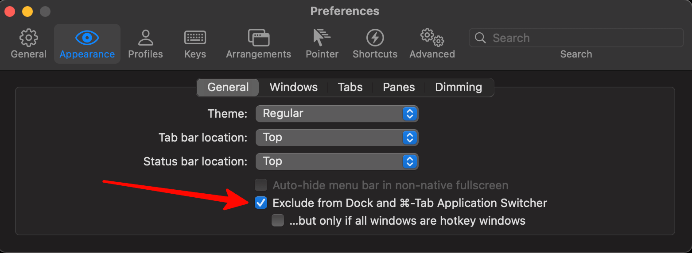
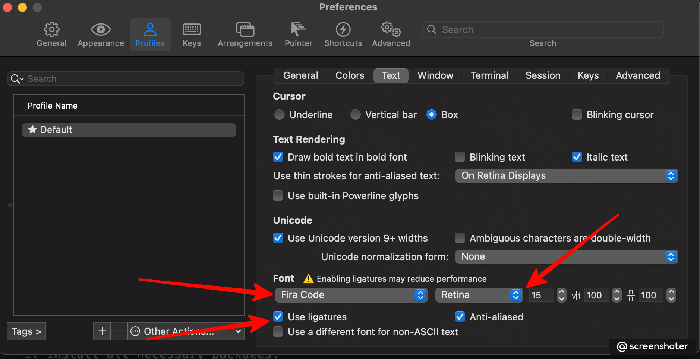
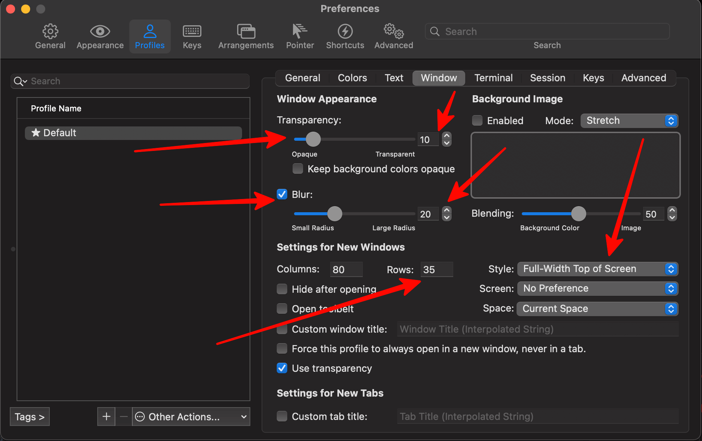
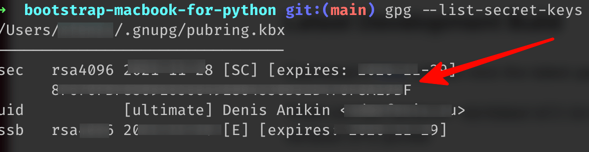

# Fresh macbook bootstrap
Say for example you got new macbook and you are web developer with stack consist of python for backend and/or typescript for frontend. This instruction will help you to prepare your macbook for work in cutting edge environment.
- [Fresh macbook bootstrap](#fresh-macbook-bootstrap)
  - [Basic setup](#basic-setup)
  - [Python part](#python-part)
  - [VSCode configuration](#vscode-configuration)

## Basic setup
1. Setup o my zsh
    ```bash
    sh -c "$(curl -fsSL https://raw.github.com/ohmyzsh/ohmyzsh/master/tools/install.sh)"
    ```
1. Generate ssh key:
    ```bash
    ssh-keygen -o -a 100 -t ed25519 -C "ad@xfenix.ru"
    ```
    Copy you key in the clipboard:
    ```
    cat ~/.ssh/id_ed25519.pub | pbcopy
    ```
1. Install FiraCode font: https://github.com/tonsky/FiraCode
1. Install chrome: https://www.google.com/chrome/
1. Reccomended extensions:
   1. https://chrome.google.com/webstore/detail/ublock-origin/cjpalhdlnbpafiamejdnhcphjbkeiagm?hl=en
   1. https://chrome.google.com/webstore/detail/tab-suspender/fiabciakcmgepblmdkmemdbbkilneeeh?hl=en
   1. Also for Russian users: https://chrome.google.com/webstore/detail/%D0%BE%D0%B1%D1%85%D0%BE%D0%B4-%D0%B1%D0%BB%D0%BE%D0%BA%D0%B8%D1%80%D0%BE%D0%B2%D0%BE%D0%BA-%D1%80%D1%83%D0%BD%D0%B5%D1%82%D0%B0/npgcnondjocldhldegnakemclmfkngch?hl=ru
   1. https://chrome.google.com/webstore/detail/grammar-spell-checker-%E2%80%94-l/oldceeleldhonbafppcapldpdifcinji
1. Install homebrew:
    ```bash
    /bin/bash -c "$(curl -fsSL https://raw.githubusercontent.com/Homebrew/install/HEAD/install.sh)"
    ```
1. Install all necessary packages:
    ```bash
    brew install postman stats itsycal git iterm2 visual-studio-code pyenv gpg-suite shottr marta node dozer appcleaner keyboardcleantool karabiner-elements
    ```
    1. <a href="https://github.com/Mortennn/Dozer" target="_blank">Dozer</a> help you to organize your menu bar, since macbook notch gain troubles in this area
    1. <a href="https://marta.sh" target="_blank">Marta</a> is the sublime-like completely free file manager
    1. AppCleaner help you clean garbage after application removal
    1. <a href="https://folivora.ai/keyboardcleantool">KeyboardCleanTool</a> helps you to clean you keyboard! Very useful app for every developer
    1. <a href="https://shottr.cc/">Shottr</a> literally best screenshot tool
    1. (Optional) Karabiner elements will be useful for remapping keys on the Russian keyboard layout. This really helps for ~ symbol return. On other keyboard layouts it not so useful by default
1. Configure Iterm2:
   1. It helps not to disturb you 
   1. Best font 
   1. Good looking + Guake/Quake like behavior 
1. For macbook with Apple chip (M1, M1 pro, M1 max) install Rosetta2: 
    ```
    softwareupdate --install-rosetta
    ```
1. Install docker dekstop: https://www.docker.com/products/docker-desktop
1. Setup git client:
   1. Generate GPG key in GPG keychain
   1. Run command:
        ```bash
        gpg --list-secret-keys
        ```
        Then copy following key:
        
   1. Setup:  
        ```bash
        git config --global user.name "Denis Anikin"
        git config --global user.email ad@xfenix.ru
        git config --global user.signingkey KEY_FROM_PREVIOUS_STEP
        git config --global commit.gpgsign true
        ```
    1. Export GPG key in GPG keychain
    1. Paste it in https://github.com/settings/gpg/new
1. File things:
   1. Create projects dir `mkdir ~/web/`
   1. Exclude from spotlight indexing (greatly reduce CPU pressure):  -> Settings -> Spotlight -> Privacy, press +, then `⌘ + shift + g` and enter following paths:
      1. `~/web/`
      1. `~/Library/Containers`

## Python part
1. Setup pyenv
    ```bash
    echo 'eval "$(pyenv init --path)"' >> ~/.zprofile
    echo 'eval "$(pyenv init -)"' >> ~/.zshrc
    ```
1. Install and select desired python
   ```bash
   pyenv install 3.12.1
   pyenv global 3.12.1
   ```
1. Install all necessary packages
    ```bash
    pip install ruff mypy
    ```
1. Configure poetry:
    ```
    poetry config cache-dir ~/.cache/pypoetry/
    ```
1. Dont forget to restart bash/zsh session!

## VSCode configuration
This config meant for python development. But you can grab any part of it for other purposes.<br>
1. Open the Command Palette (⌘ + ⇧ + P on Mac) OR View ❯ Command Palette
1. Type shell command to find Shell Command: Install 'code' command in PATH command
1. Install extensions:
    ```bash
    code --install-extension wk-j.save-and-run
    code --install-extension esbenp.prettier-vscode
    code --install-extension GitHub.github-vscode-theme
    code --install-extension helgardrichard.helium-icon-theme
    code --install-extension mde.select-highlight-minimap
    code --install-extension miguelsolorio.fluent-icons
    code --install-extension ms-python.mypy-type-checker
    code --install-extension ms-python.python
    code --install-extension ms-python.vscode-pylance
    code --install-extension yzhang.markdown-all-in-one
    ```
1. Place following in you `settings.json`:
    ```json
    {
        "workbench.colorTheme": "GitHub Dark",
        "workbench.iconTheme": "helium-icon-theme",
        "workbench.productIconTheme": "fluent-icons",

        "markdown.preview.typographer": true,
        "markdown.extension.orderedList.marker": "one",

        "editor.wordBasedSuggestions": false,
        "editor.fontFamily": "FiraCode-Retina",
        "editor.fontSize": 14,
        "editor.fontLigatures": true,
        "editor.formatOnPaste": true,
        "editor.formatOnType": true,
        "editor.formatOnSave": true,
        "editor.renderWhitespace": "all",
        "editor.rulers": [120],

        "debug.console.fontSize": 14,

        "terminal.integrated.fontSize": 14,

        "emmet.triggerExpansionOnTab": true,
        "emmet.includeLanguages": {
            "plaintext": "html"
        },

        "saveAndRun": {
            "commands": [
                {
                    "match": ".py",
                    "cmd": "ruff check --config=${workspaceFolder}/pyproject.toml ${file}",
                    "silent": true,
                },
                {
                    "match": ".py",
                    "cmd": "ruff format --config=${workspaceFolder}/pyproject.toml ${file}",
                    "silent": true,
                },
            ]
        },
    }
    ```
1. Dont forget to replace `xfenix` with you user!
